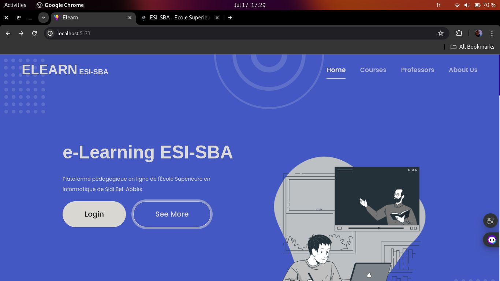
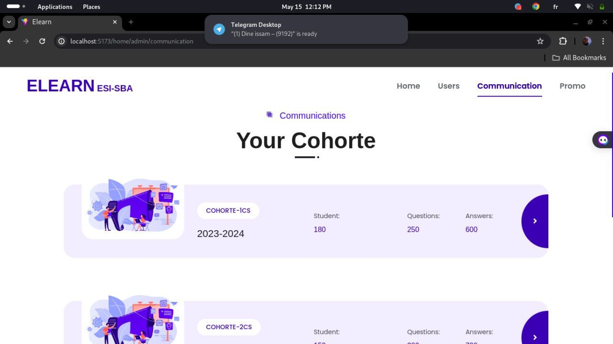
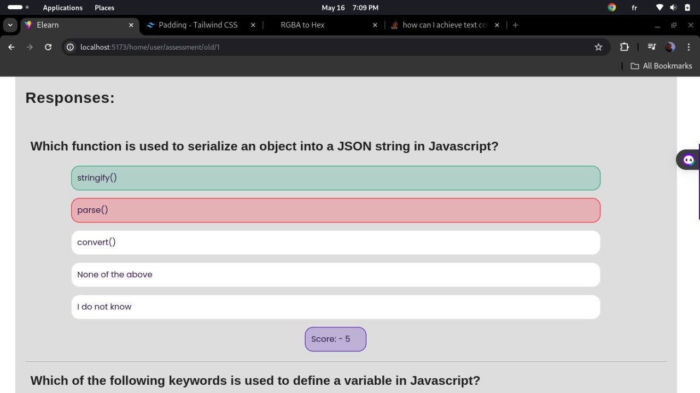

# E-Learning Platform for ESI Sidi Bel Abbès

<div align="center">
  
  

  
  [](https://www.djangoproject.com/)
  [](https://www.django-rest-framework.org/)
  [](https://www.python.org/)
  []()
  
  **A comprehensive e-learning platform revolutionizing remote education**
  
  [Features](#-features) • [Installation](#-installation) • [Documentation](#-api-endpoints) • [Team](#-team)
  
</div>

---

## 📸 Screenshots

<div align="center">
  
  
  
 
  
 

  
  
</div>

---

## 🎯 Project Overview

This platform provides robust tools and features for teachers, students, and administrators, ensuring a seamless and enriching educational journey. It supports course management, assessments, video conferencing, and collaborative learning spaces.

Developed by students at **Ecole Supérieure en Informatique de Sidi Bel Abbès**, this project aims to revolutionize remote teaching and learning experiences in Algeria and beyond.

## ✨ Features

### 👨‍🏫 Teacher's Session
- 📤 Upload and manage course materials
- 📚 Add educational resources (documents, links)
- 💬 Create communication spaces for student interaction
- 📝 Integrate formative and summative assessments
- 🎥 Create and share video call links with students
- 📖 Organize content by chapters and modules

### 👨‍🎓 Student's Session
- 📥 Access and download course materials
- 🎓 Follow MOOCs (Massive Open Online Courses)
- ✅ Complete evaluations and quizzes
- 📞 Join video calls
- 💭 Participate in discussion forums
- 📊 Track progress and grades

### 👨‍💼 Administrator's Session
- 📋 Bulk enroll students via CSV upload
- 👥 Create and manage cohorts (promotions)
- 🔐 Manage user roles and permissions
- 🏫 Organize academic structure (levels, specialties)
- 📈 Monitor platform activity

### 📝 Assessment System
- ✏️ Create quizzes with multiple-choice questions
- ⏱️ Set time limits and passing scores
- 🏷️ Organize questions by topics
- 📊 Define difficulty levels (Easy, Medium, Hard)
- ⚡ Automatic grading and instant feedback
- 📉 Track student results and performance

## 🛠️ Technology Stack

### Backend
- **Framework**: Django 4.1.3
- **API**: Django REST Framework 3.14.0
- **Authentication**: JWT (djangorestframework-simplejwt 5.2.2)
- **Database**: SQLite (development) / PostgreSQL (production ready)
- **CORS**: django-cors-headers 3.13.0

### Frontend
- **JavaScript**: jQuery for dynamic interactions
- **CSS Framework**: Bootstrap 5.1.3
- **Templates**: Django templating engine

## 📋 Prerequisites

- Python 3.8+
- pip (Python package manager)
- Virtual environment (recommended)
- Git

## 🚀 Installation

### 1. Clone the repository
```bash
git clone https://github.com/your-username/esi-elearning-platform.git
cd esi-elearning-platform
```

### 2. Create project images directory
```bash
mkdir -p docs/images
```

**Add your images to `docs/images/` folder:**
- `esi-logo.png` - ESI Sidi Bel Abbès logo
- `banner.png` - Project banner/hero image
- `dashboard.png` - Dashboard screenshot
- `quiz-interface.png` - Quiz interface screenshot
- `course-management.png` - Course management screenshot

### 3. Create and activate virtual environment
```bash
# On Windows
python -m venv venv
venv\Scripts\activate

# On macOS/Linux
python3 -m venv venv
source venv/bin/activate
```

### 4. Install dependencies
```bash
pip install -r requirements.txt
```

### 5. Configure environment variables
Create a `.env` file in the project root:
```env
SECRET_KEY=your-secret-key-here
DEBUG=True
ALLOWED_HOSTS=localhost,127.0.0.1

# Email Configuration (for production)
EMAIL_HOST=smtp.gmail.com
EMAIL_PORT=587
EMAIL_USE_TLS=True
EMAIL_HOST_USER=your-email@gmail.com
EMAIL_HOST_PASSWORD=your-app-password

# Database (optional, for PostgreSQL)
DB_NAME=elearning_db
DB_USER=postgres
DB_PASSWORD=your-password
DB_HOST=localhost
DB_PORT=5432
```

### 6. Run migrations
```bash
python manage.py migrate
```

### 7. Create a superuser
```bash
python manage.py createsuperuser
```

Follow the prompts to create an admin account.

### 8. Collect static files
```bash
python manage.py collectstatic --noinput
```

### 9. Run the development server
```bash
python manage.py runserver
```

The application will be available at `http://127.0.0.1:8000/`

**Admin Panel**: `http://127.0.0.1:8000/admin/`

## 📁 Project Structure

```
esi-elearning-platform/
├── accounts/              # User authentication and management
│   ├── models.py         # User model with custom fields
│   ├── serializers.py    # DRF serializers for auth
│   ├── views.py          # Authentication views
│   └── utils.py          # Email utilities
├── csv_app/              # Student bulk enrollment via CSV
│   ├── models.py         # Person model for students
│   └── views.py          # CSV upload logic
├── promo/                # Academic structure management
│   ├── models.py         # Promo, Niveau, Module, Chapitre
│   └── views.py          # CRUD operations
├── quizes/               # Quiz management system
│   ├── models.py         # Quiz and Topic models
│   ├── views.py          # Quiz views and data endpoints
│   └── static/           # Quiz JavaScript files
├── questions/            # Question and answer models
│   └── models.py         # Question and Answer models
├── results/              # Quiz results and scoring
│   └── models.py         # Result model
├── static/               # Static files (CSS, JS, images)
│   ├── css/
│   └── js/
├── templates/            # HTML templates
│   ├── base.html
│   └── quizes/
├── docs/                 # Documentation and images
│   └── images/           # Screenshots and logos
├── validators/           # Custom validators
├── django_rest_auth/     # Project settings
│   ├── settings.py
│   ├── urls.py
│   └── wsgi.py
├── manage.py
├── requirements.txt
└── README.md
```

## 🔐 API Endpoints

### Authentication (`/api/v1/auth/`)
| Method | Endpoint | Description |
|--------|----------|-------------|
| POST | `/register/` | User registration |
| POST | `/verify-email/` | Email verification with OTP |
| POST | `/login/` | User login (returns JWT tokens) |
| POST | `/token/refresh/` | Refresh access token |
| POST | `/logout/` | User logout (blacklist token) |
| POST | `/password-reset/` | Request password reset link |
| GET | `/password-reset-confirm/<uidb64>/<token>/` | Verify reset token |
| PATCH | `/set-new-password/` | Set new password |

### Student Management (`/etudiant/`)
| Method | Endpoint | Description |
|--------|----------|-------------|
| POST | `/upload-csv/` | Bulk upload students via CSV |
| GET | `/etudiant/` | List all students |
| POST | `/etudiant/` | Create new student |

### Academic Structure (`/promo/`)
| Method | Endpoint | Description |
|--------|----------|-------------|
| GET/POST | `/promo/` | List/Create promotions |
| GET/PUT/DELETE | `/promo/<pk>/` | Retrieve/Update/Delete promotion |
| GET/POST | `/niveau/` | List/Create levels |
| GET/POST | `/module/` | List/Create modules |
| GET/POST | `/chapitre/` | List/Create chapters |

### Course Materials (`/promo/`)
| Method | Endpoint | Description |
|--------|----------|-------------|
| GET/POST | `/cours/` | List/Upload courses |
| GET/POST | `/mooc/` | List/Upload MOOCs |
| GET/POST | `/fiche/` | List/Upload worksheets |
| GET/POST | `/ressource/` | List/Upload resources |
| GET/POST | `/devoir/` | List/Create assignments |
| GET/POST | `/commentaire/` | List/Create comments |

### Quizzes (`/quiz/`)
| Method | Endpoint | Description |
|--------|----------|-------------|
| GET | `/` | List all quizzes |
| GET | `/quiz/<pk>` | Quiz detail view (HTML) |
| GET | `/quiz/<pk>/data` | Get quiz questions (JSON) |
| POST | `/quiz/<pk>/save` | Submit quiz answers |

## 📝 Usage Examples

### 1. Register a new user
```bash
curl -X POST http://localhost:8000/api/v1/auth/register/ \
  -H "Content-Type: application/json" \
  -d '{
    "email": "student@esi-sba.dz",
    "first_name": "Mohammed",
    "last_name": "Ali",
    "password": "SecurePass123",
    "password2": "SecurePass123"
  }'
```

### 2. Login
```bash
curl -X POST http://localhost:8000/api/v1/auth/login/ \
  -H "Content-Type: application/json" \
  -d '{
    "email": "student@esi-sba.dz",
    "password": "SecurePass123"
  }'
```

### 3. Upload CSV for bulk enrollment
```bash
curl -X POST http://localhost:8000/etudiant/upload-csv/ \
  -H "Authorization: Bearer <your-access-token>" \
  -F "file=@students.csv"
```

### 4. Get quiz data
```bash
curl -X GET http://localhost:8000/quiz/quiz/1/data \
  -H "Authorization: Bearer <your-access-token>"
```

## 📊 CSV Upload Format

For bulk student enrollment, create a CSV file with this format:

```csv
full_name,email,matricule
Mohammed Ali,mohammed.ali@esi-sba.dz,202301234
Fatima Zahra,fatima.zahra@esi-sba.dz,202301235
Ahmed Karim,ahmed.karim@esi-sba.dz,202301236
```

**Requirements**:
- ✅ All emails must end with `@esi-sba.dz`
- ✅ Matricule serves as both username and default password
- ✅ UTF-8 encoding for Arabic names

## 🎨 Customization

### Adding a custom logo
Replace `docs/images/esi-logo.png` with your institution's logo.

### Changing color scheme
Edit `static/css/style.css` to customize the platform's appearance.

### Modifying email templates
Update email content in `accounts/utils.py`.

## 🔒 Security Notes

⚠️ **Important for Production**:

- [ ] Change `SECRET_KEY` in settings
- [ ] Set `DEBUG = False`
- [ ] Configure `ALLOWED_HOSTS`
- [ ] Use environment variables for sensitive data
- [ ] Enable HTTPS
- [ ] Configure proper CORS settings
- [ ] Use PostgreSQL instead of SQLite
- [ ] Set up proper email service (not Mailtrap)
- [ ] Implement rate limiting
- [ ] Regular security audits

## 🧪 Testing

Run tests with:
```bash
python manage.py test
```

## 📧 Email Configuration

**Development** (Current):
- Uses Mailtrap for testing
- OTP verification for new users
- Password reset links

**Production** (Recommended):
- Gmail SMTP / SendGrid / AWS SES
- Update `settings.py` with production credentials

## 👥 Team

<table>
  <tr>
    <td align="center">
      
      <br />
      <sub><b>Ghandouz Amina</b></sub>
    </td>
    <td align="center">
      
      <br />
      <sub><b>Dine Mohammed Assam</b></sub>
      <br />
      <sub>Backend Development</sub>
    </td>
    <td align="center">
      
      <br />
      <sub><b>Bekhti Djalal</b></sub>
    </td>
    <td align="center">
      
      <br />
      <sub><b>Benrabah Seif Islem</b></sub>
    </td>
  </tr>
</table>

**Academic Advisor**: Mr. Malki Abdelhamid

## 🎓 Institution

**Ecole Supérieure en Informatique de Sidi Bel Abbès (ESI-SBA)**

Algeria's premier institute for computer science education.

## 🎯 Future Enhancements

- [ ] Real-time video conferencing integration (Jitsi/Zoom API)
- [ ] Advanced analytics dashboard with charts
- [ ] Mobile application (React Native)
- [ ] Plagiarism detection for assignments
- [ ] Gamification features (badges, leaderboards)
- [ ] Multi-language support (Arabic, French, English)
- [ ] AI-powered content recommendations
- [ ] Offline mode for course materials
- [ ] Advanced search and filtering
- [ ] Integration with external LMS systems

## 🐛 Known Issues

- ⚠️ Email verification uses test credentials (Mailtrap)
- ⚠️ File upload size limits need configuration for large video files
- ⚠️ Timer synchronization in quizzes needs improvement
- ⚠️ Mobile responsiveness needs enhancement

## 📚 Documentation

For detailed documentation:
- **Admin Panel**: `http://127.0.0.1:8000/admin/`
- **API Root**: `http://127.0.0.1:8000/api/v1/`
- **Quiz Interface**: `http://127.0.0.1:8000/quiz/`

## 🤝 Contributing

This is an academic project. For inquiries or collaboration:

1. Fork the repository
2. Create a feature branch (`git checkout -b feature/AmazingFeature`)
3. Commit your changes (`git commit -m 'Add some AmazingFeature'`)
4. Push to the branch (`git push origin feature/AmazingFeature`)
5. Open a Pull Request

## 📄 License

This project is developed for educational purposes at ESI Sidi Bel Abbès.

**Academic License** - Not for commercial use without permission.

## 🙏 Acknowledgments

Special thanks to:
- 🏫 ESI Sidi Bel Abbès for supporting this project
- 👨‍🏫 Mr. Malki Abdelhamid for his guidance and mentorship
- 👥 All team members for their dedication and hard work
- 💡 The Django and DRF communities for excellent documentation


---

<div align="center">
  
  **Made with ❤️ by ESI-SBA Students**
  
  ⭐ Star us on GitHub if you find this project useful!
  
  
  
</div>
